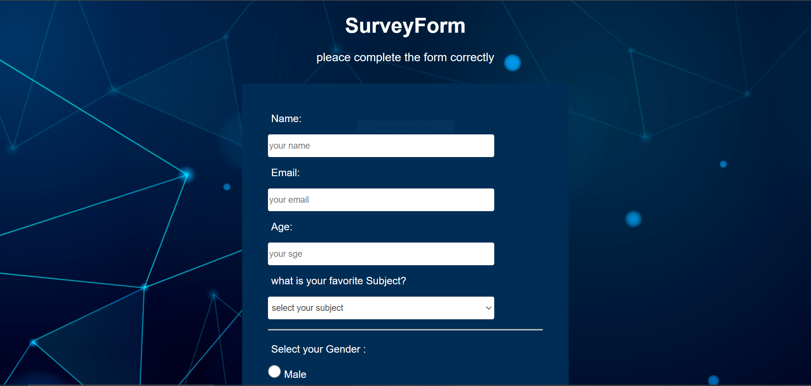

# Survey_Form 🚀

## Project Description 📝
create a complete survey form using HTML and CSS
applied some HTML form validation.
input reliable data from users.
CSS style to make form more user frindly.


## Demo 📸
live demo : [(https://farwamuhibzada.github.io/Survey_Form/)]

here is a demo of Product Landing Page .




## Technologies Used 🛠️

List the technologies or tools that i used to develop this project. 
- HTML
- CSS


## Installation 💻

for using this project you neet to install 3 things:

- chrombrowser
- an IDE like vscode
- git


## Usage 🎯

for using this project you need to know a few commond first clone the repositry in yor local machine then go to the github directory . open the project on your IDE like vscode and start working on it .


go to the cmd and clone the Technical Documentation Page 
using this commond:
```bash

git clone https://github.com/FarwaMuhibZada/Survey_form.git 
```
go to the githu directory:
```bash

cd>Survey_form

```
open the project on your IDE like vscode :

```bash

cd>Survey_form> code .

```


## Features ⭐
- Responsive form


## FarwaMuhibzada 👩‍💻


- LinkedIn: [(https://www.linkedin.com/in/farwa-muhibzada/)]
- Email: [(farwafarid2017@gmail.com)]

## Contributing 🤝
For contribution you can create a pull request and mention me there.Thank you.


